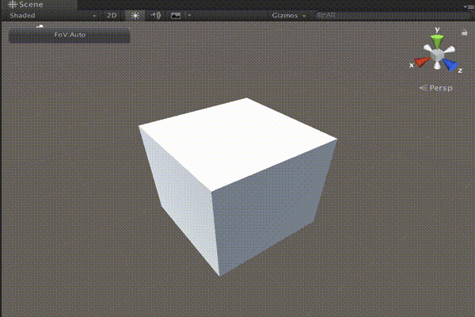

[日本語はこちら / Japanese](README.ja.md)

# Unity Editor Extension Controls Field of View (FoV) in Scene View

|Demo				|
|--------------------		|
|	|

|Wide angle			|Telescopic (narrow angle)		|
|--------------------		|-------------------------		|
|	|	|

One thing [people](https://feedback.unity3d.com/suggestions/editor-camera-fov-adjustable) [repeatedly say](https://feedback.unity3d.com/suggestions/scene-view-camera-field-of-view-adjustment) is missing in Unity Editor's Scene View is that there is no way to control the Field of View (FoV).
With this extension, you will now be able to do this using the Unity Editor's private API.

## How to use

- Import [this .unitypackage](https://github.com/t-mat/UnitySceneViewFovControl/releases/download/0.1.6/SceneViewFovControl.unitypackage) to your Unity project.
    - Import from the file by selecting "Assets > Import Package > Custom Package."
- You will be able to do the following in Scene View after importing.

|Keyboard/Mouse					|Effect							|Note			|
|--------------------				|-------------------------				|----			|
|`FoV` button in the toolbar of Scene View	|Toggle FoV mode (auto / manual)			|			|
|Ctrl + Alt + Wheel				|Changes FoV						|			|
|Ctrl + Alt + Shift + Wheel			|Changes FoV (high speed)				|Unavailable on Mac	|
|Ctrl + Alt + O					|Increases FoV (wide angle)				|			|
|Ctrl + Alt + P					|Reduces FoV (narrow angle/telescopic)			|			|
|Ctrl + Alt + Shift + O				|Increases FoV (high speed, wide angle)			|			|
|Ctrl + Alt + Shift + P				|Reduces FoV (high speed, narrow angle/telescopic)	|			|

A reset button will appear in the top left of the Scene View if you change the FoV.  Clicking this button will return the Scene View's FoV back to its default.

## Changing and Saving Settings

Select "Edit" > "Scene View FoV Settings" in the Unity Editor menu to open the settings window.

|Item				|Meaning						|
|--------------------		|-------------------------				|
|FoV Speed			|Changes FoV speed					|
|FoV Shift Modifier Multiplier	|Multiplies the modifier speed when pressing Shift	|
|Min FoV			|Minimizes FoV (angular unit)				|
|Max FoV			|Maximizes FoV (angular unit)				|
|				|							|
|Save				|Saves the settings					|
|Restore Default Settings	|Restores the default settings				|
|Restore Saved Settings		|Restores the saved settings				|
|Close				|Closes the window					|

## License

[MIT](LICENSE.txt)
