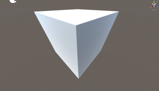
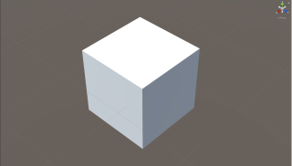

# Scene View での FoV (画角) を操作する Unity Editor 拡張

|広角				|望遠 (狭角)				|
|--------------------		|-------------------------		|
|	|	|

Unity Editor のシーンビュー (Scene View) に対する不満の１つとして、 FoV (画角) が操作できないことがしばしば挙げられます。
この Unity Editor 拡張は、 Unity Editor の非公開 API を用いて、その不満の一部を解消するものです。

## 使い方

- [この .unitypackage](https://github.com/t-mat/UnitySceneViewFovControl/releases/download/0.1.0/SceneViewFovControl.unitypackage) を Unity プロジェクトにインポートします
    - ファイルからのインポートは "Assets > Import Package > Custom Package..." から行います
- インポート後、 シーンビュー (Scene View) 内で以下の操作が可能になります

|キー/マウス操作		|効果					|
|--------------------		|-------------------------		|
|Ctrl + Alt + ホイール		|FoV (画角) の変更			|
|Ctrl + Alt + Shift + ホイール	|FoV (画角) の変更 (高速)		|
|Ctrl + Alt + O			|FoV (画角) の増加 (広角)		|
|Ctrl + Alt + P			|FoV (画角) の減少 (狭角 / 望遠)	|
|Ctrl + Alt + Shift + O		|FoV (画角) の増加 (高速、広角)		|
|Ctrl + Alt + Shift + P		|FoV (画角) の減少 (高速、狭角 / 望遠)	|

## ライセンス

[MIT](LICENSE.txt)
